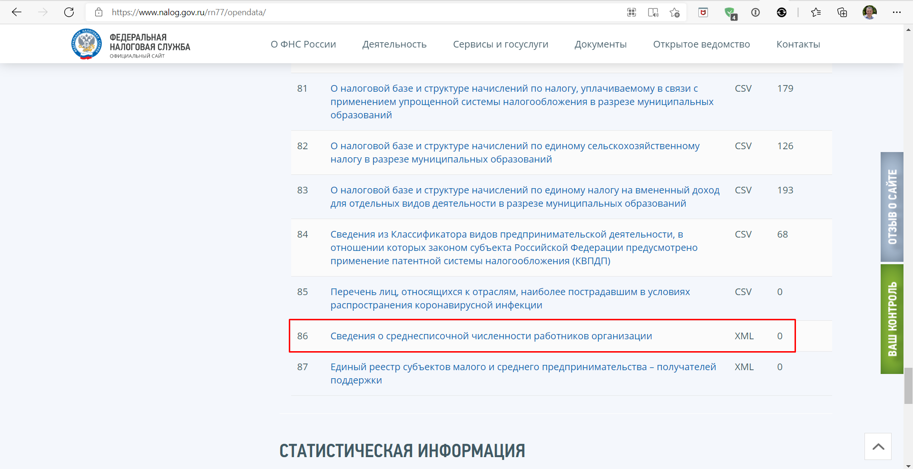
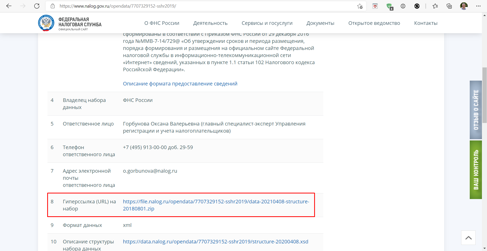
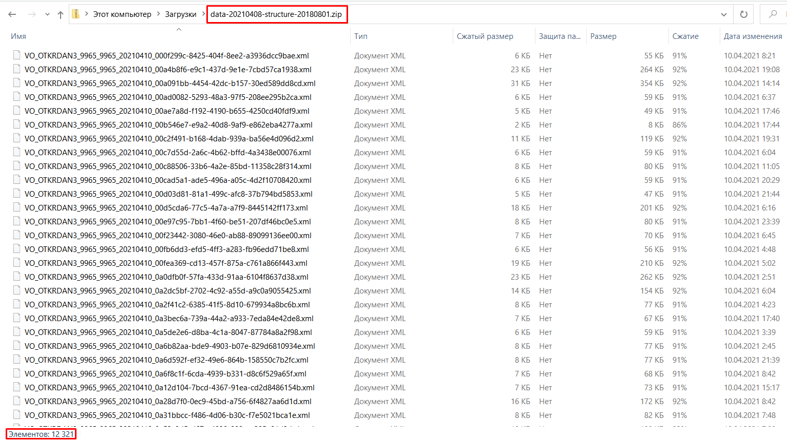
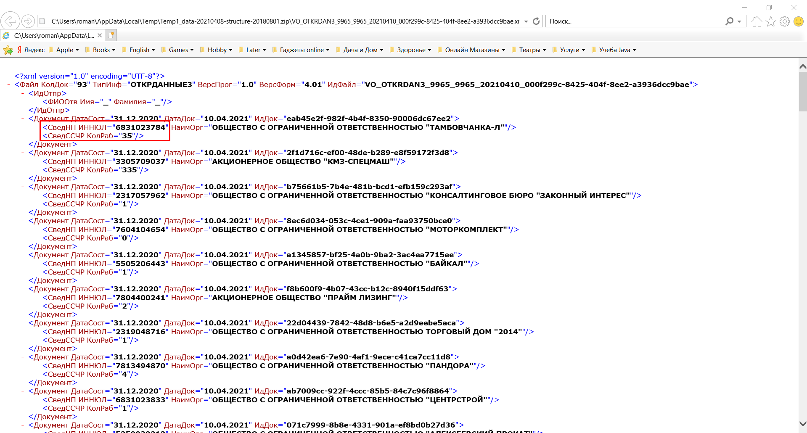

# nalog_parser

На сайте налоговой есть открытые данные пункт 86	
Сведения о среднесписочной численности работников организации, по этой ссылке можно перейти на страницу загрузки файла.
Проверить сайт на доступность 200 OK!

После как получили предыдущую ссылку и открыли ее, текущая страница содержит
пункт 8 Гиперссылка (URL) на набор это ссылка на zip архив ~120МБайт.

Внутри архива XML файлы, которые надо каждый распарсить и вытащить два тега(ИНН, кол-во работников) и сохранить

Получить два тега из каждой уникальной записи в xml(ИНН, кол-во работников) и сохранить

Парсить в несколько потоков и вывести 5 максимальных записей по одному из тегов(кол-во работников)


##Конфигурирование:

*   app.properties

siteUrl - Url https://www.nalog.gov.ru/rn77/opendata/ ссылка на открытые данные.
```
    siteUrl = https://www.nalog.gov.ru/rn77/opendata/
```
##Контакты:
*   skype: rusanov_roman
*   telegram: @Roman_Rusanov